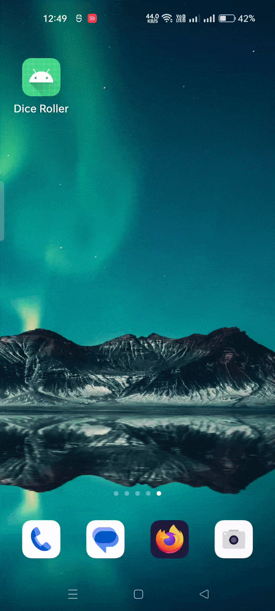

# Dice Roller

## Introduction

This dice roller android app that rolls a dice and shows the result on screen. create toastr when the dice match 3 :-) my lucky number

## Behavior

- **First there no dice displayed on the display**
- **After clicking on the roll button image will display with a number between 1-6 by default**
- **Now after every click on the roll button update the image that display a random slide with a value**
- **If the match the value "3" then it will trigger a toastr to say "It's you lucky number""**

## Demonstration

